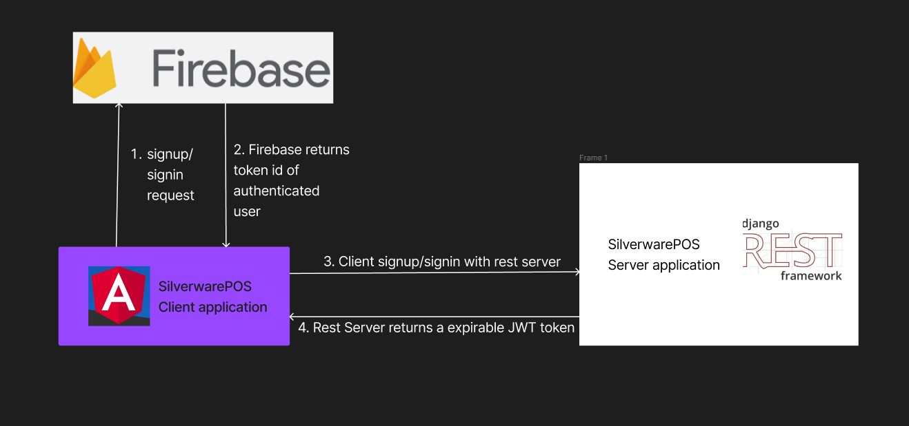
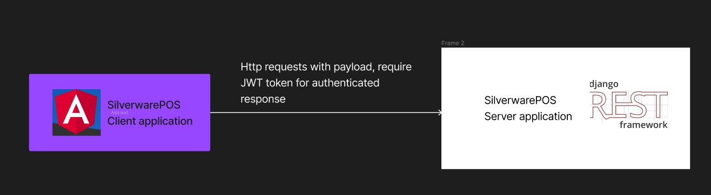
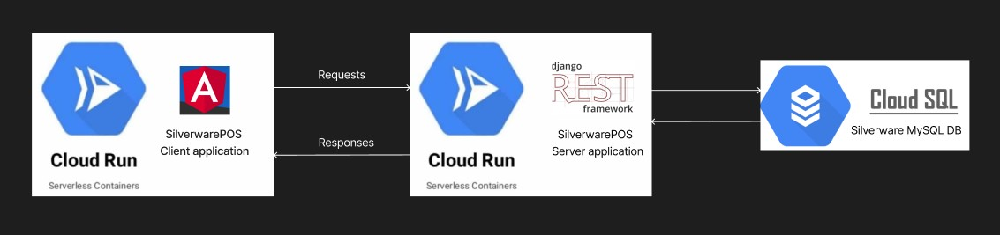
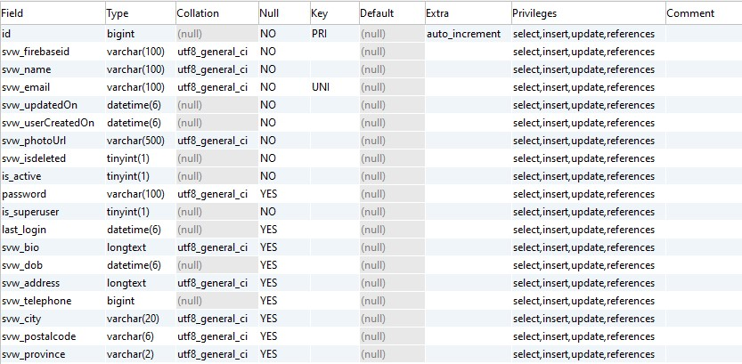

# Silverware Profile App

The applications best suits for users with a google account to save their data in silverware database. 

## Architecture
### User authentication


### API calls with authentication


## Development server setup for Server application:
Tools requirements: <br>
Python: version above 3.11.0 <br>
Pip: latest

### Option 1:
1. Open a command line and Change directory to backend/silverware
2. Run  ```pip install -r requirements.txt``` and this installs all the dependency packages. 
3. Run ```python3 manage.py runserver``` and this starts a local django rest server at default port 8000. ex: http://localhost:8000

### Option 2: Docker image
1. System requirements: Docker client
2. Open a command line and Change directory to backend/silverware
3. Run ``` docker build -t silverware/backend:latest .```
4. Run ``` docker run -p 8000:8000 silverware/backend:latest ``` ex: -p [host machine port]:[container port]
5. This will run a backend server at http://localhost:8000


## Development server setup for Client application:
Tools requirements: <br>
NodeJS: version above 18.12.0 <br>
NPM: version above 8.19.2

1. Open a command line and Change directory to frontend/silverware
2. In the directory frontend/silverware/src/environments/environment.dev.ts,
edit apiServer:"" value to local rest API server ex: http://localhost:8000. Currently it points to cloud instance of API server. (https://backend-yopxzgdubq-uc.a.run.app)
3. Run  ```npm install``` and this installs all the dependency packages. 
4. Run ```npm install -g @angular/cli```
5. Run ```ng serve``` 

### Option 2: Docker image
1. System requirements: Docker client
2. Open a command line and Change directory to frontend/silverware
3. Run ``` docker build -t silverware/frontend:latest .```
4. Run ``` docker run -p 4200:4200 silverware/frontend:latest ``` ex: -p [host machine port]:[container port]
5. This will run the client application at http://localhost:4200

## CI/CD Setup

The CI/CD setup builds the docker images on every push to master branch and deploys it in GCP cloud run instance. the changes take aprroximately 5 minutes to reflect in GCP clourrun services. 

The CI/CD is enabled using <a href="https://github.com/subhambiswajit/Silverware/actions">Github Actions.</a> 

## Infrastructure Setup 


Backend service: https://backend-yopxzgdubq-uc.a.run.app <br>
Frontend service: https://frontend-yopxzgdubq-uc.a.run.app

## Database User schema

